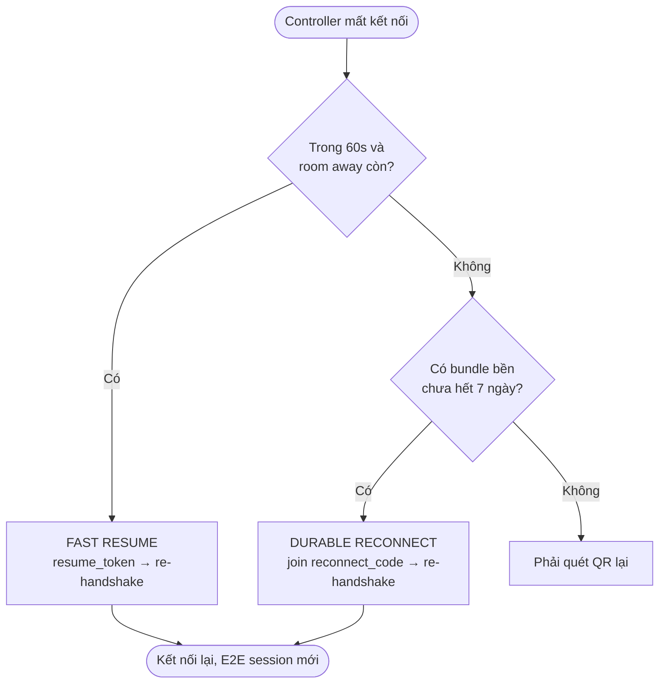
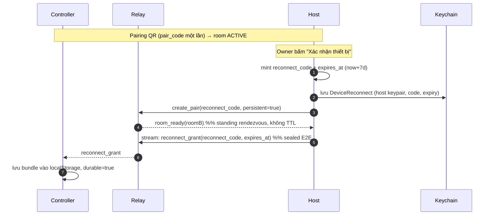
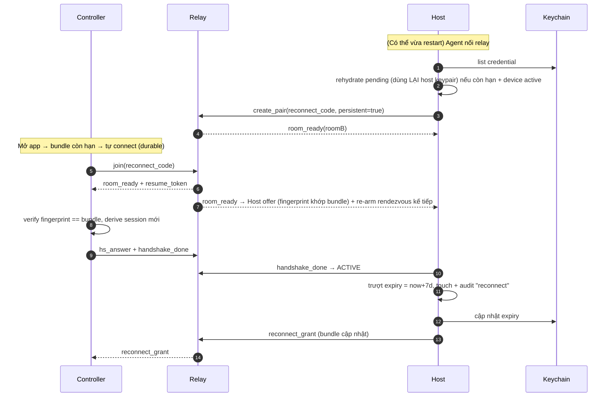
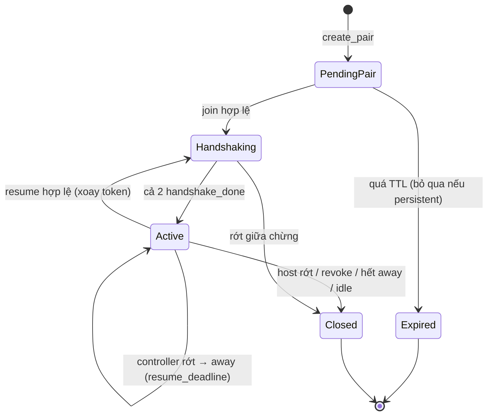
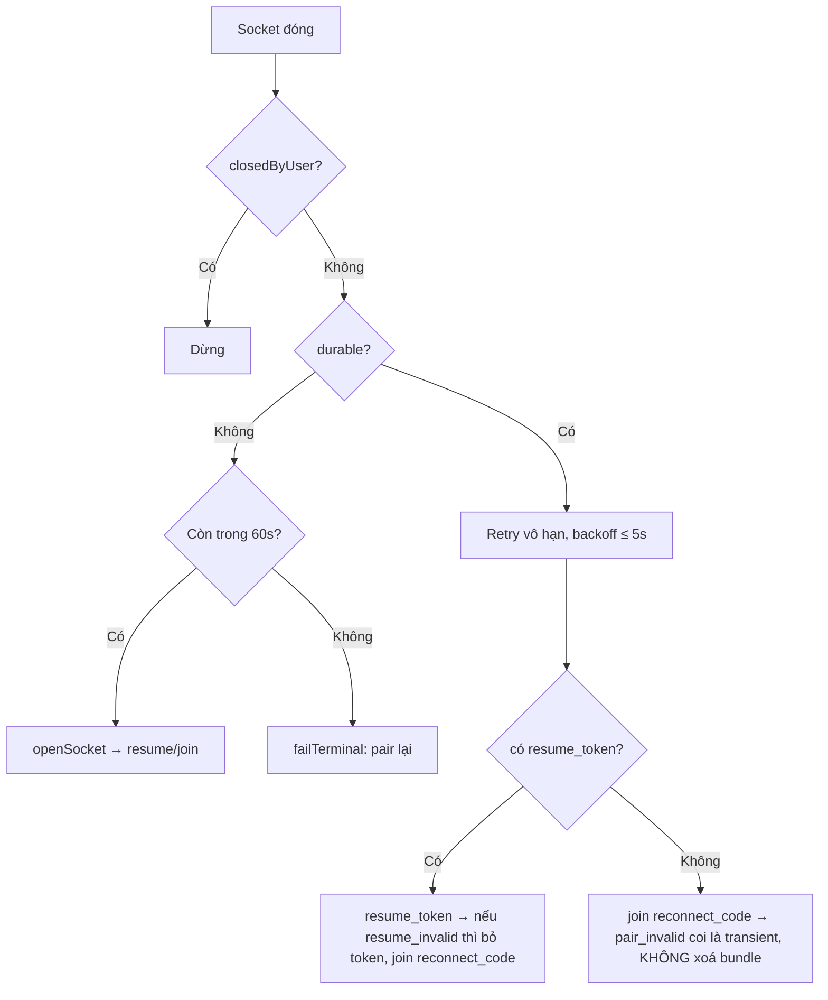
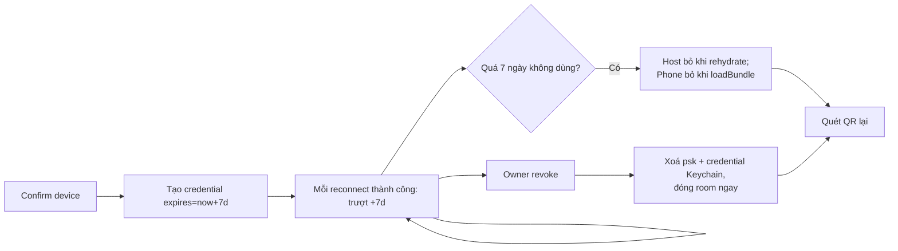

# SRS — Điều khiển từ xa Devdy qua Cloud Relay tự viết (C1)

- **Mã tài liệu:** SRS-RC-C1
- **Phiên bản:** 1.1 (bổ sung §13 — Auto Reconnect & Durable Trusted Device)
- **Ngôn ngữ:** Tiếng Việt
- **Trạng thái:** Đã chốt, sẵn sàng estimate/triển khai

### Hằng số cấu hình đã chốt
| Hằng số | Giá trị | Ý nghĩa |
|---|---|---|
| `PAIR_TTL` | 60 giây | QR/pair_code hết hạn sau 60s nếu không dùng |
| `RECONNECT_WINDOW` | 60 giây | Cửa sổ **fast-resume**: relay giữ room "away" để Controller resume nhanh sau khi rớt (§13) |
| `TRUST_TTL` | 7 ngày (trượt) | Cửa sổ **durable reconnect**: thiết bị đã confirm tự nối lại không cần QR; gia hạn mỗi lần kết nối (§13) |
| `CMD_RATE_LIMIT` | 30 lệnh/phút | Trần số lệnh Controller gửi tới Host |
| `MAX_CONTROLLER` | 1 | Số Controller tối đa trong một room tại một thời điểm |

---

## 1. Giới thiệu

### 1.1 Mục đích
Đặc tả yêu cầu phần mềm cho chức năng **Remote Control** của Devdy: cho phép điều khiển một phiên Devdy đang chạy trên máy dev từ **điện thoại hoặc máy tính khác qua Internet**, vượt NAT/firewall, thông qua một **relay WebSocket tự viết** đặt trên VPS. Người dùng ở xa có thể xem stream của run, trả lời yêu cầu duyệt tool (permission), và ra một số lệnh điều khiển giới hạn.

### 1.2 Phạm vi (Scope)

**Trong phạm vi (In-scope):**
- Relay WebSocket viết bằng Rust, deploy theo Topology B (bind `localhost`, reverse proxy WSS qua nginx/apache sẵn có trên VPS PROD).
- Devdy agent (Host) kết nối outbound tới relay và đăng ký làm host.
- Web client (Controller) responsive, kết nối outbound tới relay, tái dùng component hiển thị của Devdy.
- Ghép cặp thiết bị bằng **QR one-time + PSK**, có hết hạn.
- **E2E encryption** giữa Host và Controller; relay không đọc được payload.
- Relay hóa (relay) luồng event NDJSON sẵn có: `run:event`, `run:output`, `run:permission_request`.
- Chuyển tiếp lệnh Controller → Host cho tập lệnh giới hạn: `respond_permission`, `start_run` (và tập mở rộng ở FR-009).
- Quản lý thiết bị đã ghép + thu hồi (revoke).
- Audit log các lệnh đến từ remote.
- Khóa cứng permission mode = `default` cho mọi phiên remote.

**Ngoài phạm vi (Out-of-scope) ở phiên bản 1.0:**
- WebRTC P2P trực tiếp / chia sẻ màn hình / voice.
- **Nhiều Controller cùng lúc trong một room** — bản 1.0 chỉ 1 thiết bị tại một thời điểm (đã chốt, ưu tiên bảo mật).
- Một Controller điều khiển **nhiều máy dev (Host)** đồng thời — bản 1.0 chỉ 1 máy dev, 1 người dùng.
- Relay **multi-tenant** cho nhiều người dùng — bản 1.0 dùng riêng cho 1 owner.
- Tự động deploy relay từ Devdy qua `servers.ts` (giai đoạn sau).
- Chỉnh sửa file / mở terminal trực tiếp từ Controller ngoài các lệnh đã liệt kê.
- **"Allow always" (nhớ quyền) từ Controller** — chỉ được thao tác tại Host (đã chốt, ưu tiên bảo mật).

### 1.3 Glossary
| Thuật ngữ | Ý nghĩa |
|---|---|
| **Host** | Instance Devdy chạy trên máy dev, nơi run thực thi; đóng vai server điều khiển thực sự. |
| **Controller** | Thiết bị điều khiển từ xa (điện thoại/máy khác) chạy web client. |
| **Relay** | Dịch vụ WebSocket trên VPS chỉ làm nhiệm vụ bắc cầu, không hiểu nội dung. |
| **Room / Session** | Kênh logic ghép 1 Host với ≥1 Controller sau khi pairing. |
| **Pairing** | Quy trình ghép cặp thiết bị bằng QR chứa `pair_code` + `psk`. |
| **PSK** | Pre-shared key sinh khi pairing, dùng để E2E encrypt payload. |
| **Envelope** | Khung message ngoài cùng qua relay: `{ t, room_id, ... }`; relay chỉ đọc `room_id`. |
| **Run** | Một phiên chạy AI trong Devdy, định danh bởi `run_id`. |
| **Permission request** | Yêu cầu duyệt tool do sidecar phát ra (`run:permission_request`). |

### 1.4 Tham chiếu
- Kiến trúc Devdy hiện tại: luồng event `run:event`/`run:output`/`run:permission_request`, command `respond_permission`/`start_run` (nguồn: khảo sát codebase trong hội thoại).
- VPS PROD: `<VPS_IP>`, SSH `<SSH_PORT>`, đang chạy web Node.js + PHP (nginx/apache chiếm 80/443).

---

## 2. Tổng quan hệ thống

### 2.1 Kiến trúc tổng thể
```
[Máy dev / Devdy Host] ──outbound WSS──►┌─────────┐◄──outbound WSS── [Controller: phone/PC]
        (Tauri, Rust)                    │  Relay  │                   (web client Vue)
                                         │  (VPS)  │
   nginx/apache (TLS, 443) ──proxy──► relay bind 127.0.0.1:PORT
```
- Cả Host và Controller đều **kết nối ra** relay → không cần mở port ở máy dev, luôn vượt NAT.
- Relay chỉ định tuyến theo `room_id`; payload nghiệp vụ được E2E encrypt.

### 2.2 Actor
| Actor | Loại | Mô tả | Quyền chính |
|---|---|---|---|
| **Host (Devdy)** | Hệ thống/agent | Thực thi run, nguồn phát stream, thi hành lệnh. | Đăng ký host, phát stream, nhận & thực thi lệnh hợp lệ, chấp thuận/từ chối pairing. |
| **Controller** | Người dùng qua thiết bị | Người dùng (thường là chính chủ) điều khiển từ xa. | Join room sau pairing, xem stream, gửi lệnh trong danh sách cho phép. |
| **Relay** | Hệ thống trung gian | Bắc cầu WSS, quản lý room. | Chỉ chuyển tiếp envelope theo `room_id`; không giải mã payload. |
| **Owner** | Người dùng | Chủ sở hữu máy dev, người khởi tạo pairing và quản lý thiết bị. | Tạo/hủy pairing, xem & thu hồi thiết bị, xem audit log. |

### 2.3 Ràng buộc kỹ thuật (Constraints)
- **CON-01:** Relay bind `localhost`, đứng sau nginx/apache sẵn có (Topology B). Không tự cầm port 443.
- **CON-02:** Relay chạy bằng user riêng (không phải root), có `systemd` giới hạn tài nguyên; đặt trên server prod PROD.
- **CON-03:** Toàn bộ đường truyền dùng WSS (TLS). Không cho phép ws:// ra Internet.
- **CON-04:** Relay không lưu và không giải mã được payload nghiệp vụ (chỉ thấy ciphertext + `room_id`).
- **CON-05:** Permission mode của phiên remote bị khóa cứng = `default`; Controller không được đặt `bypassPermissions`/`acceptEdits`/`plan`.
- **CON-06:** Host là nguồn chân lý (source of truth) cho trạng thái run; Controller chỉ là chiếu (projection).

---

## 3. Yêu cầu chức năng (Functional Requirements)

### FR-001 — Host đăng ký với relay
- **Actor:** Host.
- **Trigger:** Owner bật tính năng Remote Control trong Devdy, hoặc app khởi động khi tính năng đang bật.
- **Preconditions:** Cấu hình relay (URL) hợp lệ; có `device_id` + `auth_token` của Host.
- **Main flow:**
  1. Host mở kết nối WSS outbound tới relay.
  2. Host gửi `register_host { device_id, auth_token }`.
  3. Relay xác thực `auth_token`; nếu hợp lệ, giữ kết nối long-lived và đánh dấu Host `online`.
  4. Host hiển thị trạng thái "Remote: đang chờ" trong UI.
- **Error flows:** `auth_token` sai → relay đóng kết nối kèm mã lỗi; Host hiển thị lỗi và không retry vô hạn (BR-010).
- **Postconditions:** Host ở trạng thái `REGISTERED`, sẵn sàng nhận pairing.
- **Business rules:** BR-001, BR-010. **Security:** SEC-001. **Nguồn:** SRC-001, SRC-004.

**Acceptance criteria**
```gherkin
Scenario: Host đăng ký thành công
  Given Owner đã bật Remote Control với relay URL hợp lệ
  When Host gửi register_host với auth_token hợp lệ
  Then relay giữ kết nối và đánh dấu Host online
  And Devdy hiển thị trạng thái "Remote: đang chờ"

Scenario: Host đăng ký với token sai
  Given auth_token của Host không hợp lệ
  When Host gửi register_host
  Then relay đóng kết nối kèm mã lỗi xác thực
  And Devdy hiển thị lỗi và dừng retry theo BR-010
```

### FR-002 — Tạo mã ghép cặp (QR)
- **Actor:** Owner (trên Host).
- **Trigger:** Owner bấm "Ghép thiết bị mới".
- **Preconditions:** Host ở trạng thái `REGISTERED`.
- **Main flow:**
  1. Host sinh `pair_code` one-time + `psk` ngẫu nhiên đủ mạnh.
  2. Host hiển thị QR chứa `{ relay_url, pair_code, psk, host_fingerprint }`.
  3. Host đăng ký `pair_code` với relay ở trạng thái chờ join, kèm hạn `PAIR_TTL`.
- **Business rules:** BR-002 (one-time, TTL), BR-003 (psk không rời khỏi 2 đầu qua kênh relay dạng cleartext). **Security:** SEC-002. **Nguồn:** SRC-003.

**Acceptance criteria**
```gherkin
Scenario: Sinh QR ghép cặp
  Given Host đang REGISTERED
  When Owner bấm "Ghép thiết bị mới"
  Then Host hiển thị QR chứa pair_code one-time và psk
  And pair_code hết hạn sau PAIR_TTL nếu không được dùng
```

### FR-003 — Controller ghép cặp và join room
- **Actor:** Controller.
- **Trigger:** Controller quét QR / nhập link.
- **Preconditions:** `pair_code` còn hiệu lực.
- **Main flow:**
  1. Controller mở web client, đọc `relay_url`, `pair_code`, `psk`, `host_fingerprint` từ QR.
  2. Controller kết nối WSS ra relay, gửi `join { pair_code }`.
  3. Relay đối chiếu `pair_code`, tạo `room_id`, ghép Host ↔ Controller.
  4. Host và Controller thực hiện handshake E2E (dựa trên `psk`) và xác thực `host_fingerprint`.
  5. Sau handshake thành công, Owner **xác nhận thiết bị mới** trên Host (BR-004).
  6. Room chuyển sang `ACTIVE`; Controller bắt đầu nhận stream.
- **Alternative flows:** `pair_code` hết hạn/đã dùng → relay từ chối join (BR-002).
- **Error flows:** handshake E2E thất bại hoặc fingerprint không khớp → hủy room, ghi audit (SEC-006).
- **Postconditions:** Thiết bị được thêm vào danh sách đã ghép (DATA-002).
- **Business rules:** BR-002, BR-004. **Security:** SEC-002, SEC-006. **Nguồn:** SRC-003.

**Acceptance criteria**
```gherkin
Scenario: Ghép cặp thành công
  Given pair_code còn hiệu lực
  When Controller gửi join(pair_code) và handshake E2E thành công
  And Owner xác nhận thiết bị mới trên Host
  Then room chuyển ACTIVE và Controller bắt đầu nhận stream

Scenario: Ghép cặp bằng mã hết hạn
  Given pair_code đã hết hạn theo PAIR_TTL
  When Controller gửi join(pair_code)
  Then relay từ chối và không tạo room
```

### FR-004 — Chuyển tiếp stream run tới Controller
- **Actor:** Host → Controller (qua Relay).
- **Trigger:** Có run đang chạy hoặc event mới phát sinh.
- **Preconditions:** Room `ACTIVE`.
- **Main flow:**
  1. Host bắt các Tauri event `run:event`, `run:output` của các run đang theo dõi.
  2. Host đóng gói vào envelope `{ t:"stream", room_id, run_id, cipher }` (payload E2E-encrypt) và gửi qua relay.
  3. Relay chuyển tiếp tới Controller theo `room_id`.
  4. Controller giải mã, cập nhật UI (tái dùng logic StreamLog).
- **Business rules:** BR-005 (chỉ chuyển tiếp run được Owner cho phép chia sẻ). **Nguồn:** SRC-005.

**Acceptance criteria**
```gherkin
Scenario: Controller thấy stream thời gian thực
  Given room ACTIVE và có run đang chạy
  When Host phát event run:event/run:output
  Then Controller nhận và hiển thị nội dung tương ứng sau khi giải mã
```

### FR-005 — Replay lịch sử khi Controller vào muộn
- **Actor:** Controller.
- **Trigger:** Controller join khi run đã chạy được một lúc.
- **Preconditions:** Có log `.devdy/runs/<run_id>.log`.
- **Main flow:**
  1. Controller gửi `request_history { run_id }`.
  2. Host đọc log đã ghi và stream lại theo lô (batch) trước khi tiếp nối live.
- **Business rules:** BR-006 (giới hạn kích thước replay). **Nguồn:** SRC-005 (derived).

**Acceptance criteria**
```gherkin
Scenario: Xem lại nội dung đã trôi qua
  Given run đã phát nhiều event trước khi Controller join
  When Controller yêu cầu lịch sử run đó
  Then Host gửi lại nội dung log rồi tiếp nối stream live không trùng lặp
```

### FR-006 — Chuyển tiếp yêu cầu duyệt tool tới Controller
- **Actor:** Host → Controller.
- **Trigger:** Sidecar phát `run:permission_request`.
- **Preconditions:** Room `ACTIVE`.
- **Main flow:**
  1. Host đóng gói `{ t:"permission_request", room_id, run_id, request_id, tool, input(cipher) }` gửi qua relay.
  2. Controller hiển thị modal duyệt (tái dùng PermissionPrompt): tool name, diff/preview, đường dẫn.
- **Business rules:** BR-007. **Security:** SEC-005. **Nguồn:** SRC-005, SRC-006.

**Acceptance criteria**
```gherkin
Scenario: Yêu cầu duyệt tool hiện trên Controller
  Given room ACTIVE và sidecar phát permission_request
  When Host chuyển tiếp yêu cầu
  Then Controller hiển thị tool, preview thay đổi và các nút duyệt
```

### FR-007 — Controller trả lời yêu cầu duyệt tool
- **Actor:** Controller → Host.
- **Trigger:** Người dùng bấm **Allow once / Deny once** (UI Controller ẩn nút Allow always/Deny always theo BR-016).
- **Preconditions:** Đang có `request_id` chờ xử lý.
- **Main flow:**
  1. Controller gửi `{ t:"cmd", action:"respond_permission", room_id, run_id, request_id, decision }` với `decision ∈ { allow_once, deny_once }`.
  2. Host xác thực lệnh (BR-008, BR-016 — từ chối `allow_always`/`deny_always` từ Controller), gọi command `respond_permission` nội bộ.
  3. Kết quả áp dụng vào run; trạng thái mới được stream lại cho mọi Controller trong room.
- **Alternative flows:** `request_id` đã được xử lý (bởi Owner tại Host hoặc Controller khác) → Host bỏ qua và thông báo đã xử lý (BR-009).
- **Error flows:** decision không hợp lệ → Host từ chối, ghi audit.
- **Business rules:** BR-008, BR-009. **Security:** SEC-003, SEC-005, SEC-007. **Nguồn:** SRC-006.

**Acceptance criteria**
```gherkin
Scenario: Duyệt tool từ xa
  Given Controller đang thấy một permission_request chờ xử lý
  When Controller gửi respond_permission với decision hợp lệ
  Then Host áp dụng quyết định vào run
  And mọi Controller trong room thấy trạng thái cập nhật

Scenario: Chống double-response
  Given một request_id đã được xử lý ở Host
  When Controller gửi respond_permission cho cùng request_id
  Then Host bỏ qua và báo "đã xử lý", không thay đổi trạng thái run
```

### FR-008 — Controller khởi chạy run (start_run) từ xa
- **Actor:** Controller → Host.
- **Trigger:** Người dùng chọn/khởi chạy một run.
- **Preconditions:** Room `ACTIVE`; run/project hợp lệ trên Host.
- **Main flow:**
  1. Controller gửi `{ t:"cmd", action:"start_run", room_id, run_id, ... }`.
  2. Host xác thực (BR-008), gọi `start_run` nội bộ với **permission mode bị ép = `default`** (CON-05).
  3. Host stream tiến trình về Controller.
- **Business rules:** BR-008, BR-011. **Security:** SEC-003, SEC-004. **Nguồn:** SRC-002, SRC-006.

**Acceptance criteria**
```gherkin
Scenario: Chạy run từ xa với permission mode bị khóa
  Given room ACTIVE
  When Controller gửi start_run
  Then Host chạy run với permission mode = default
  And không cho phép Controller đặt bypassPermissions/acceptEdits/plan
```

### FR-009 — Tập lệnh Controller được phép (allow-list)
- **Actor:** Host.
- **Mô tả:** Host duy trì danh sách lệnh hợp lệ từ Controller. Lệnh ngoài danh sách bị từ chối và ghi audit.
- **Danh sách phiên bản 1.0 (đã chốt):** `respond_permission`, `start_run`, `request_history`, `cancel_run`, `send_chat_message`.
- **Ghi chú:** Mục tiêu "y hệt ngồi trước máy thật" — Controller làm được mọi thao tác vận hành run, **ngoại trừ** hai chốt bảo mật: (1) không đổi được permission mode (luôn `default`), (2) không bấm được "Allow always". Hai thao tác này chỉ làm tại Host.
- **Business rules:** BR-008, BR-015. **Security:** SEC-003. **Nguồn:** SRC-002, SRC-006.

**Acceptance criteria**
```gherkin
Scenario: Từ chối lệnh ngoài allow-list
  Given Controller gửi một action không nằm trong allow-list
  When Host nhận lệnh
  Then Host từ chối lệnh và ghi 1 bản ghi audit
```

### FR-010 — Quản lý và thu hồi thiết bị
- **Actor:** Owner (trên Host).
- **Trigger:** Owner mở màn hình "Thiết bị đã ghép".
- **Main flow:**
  1. Host hiển thị danh sách thiết bị (tên, lần cuối kết nối, trạng thái).
  2. Owner bấm "Thu hồi" một thiết bị.
  3. Host vô hiệu hóa `psk`/credential của thiết bị và đóng room liên quan ngay lập tức.
- **Postconditions:** Thiết bị bị thu hồi không thể join lại bằng credential cũ.
- **Business rules:** BR-012. **Security:** SEC-008. **Nguồn:** SRC-004.

**Acceptance criteria**
```gherkin
Scenario: Thu hồi thiết bị đang kết nối
  Given một thiết bị đã ghép đang ở room ACTIVE
  When Owner thu hồi thiết bị đó
  Then room bị đóng ngay và thiết bị không thể tái kết nối bằng credential cũ
```

### FR-011 — Audit log lệnh remote
- **Actor:** Host.
- **Mô tả:** Mọi lệnh đến từ Controller (kể cả bị từ chối) được ghi audit: thời điểm, `device_id`, `room_id`, `run_id`, action, kết quả.
- **Business rules:** BR-013. **Security:** SEC-007. **Data:** DATA-003. **Nguồn:** SRC-004.

**Acceptance criteria**
```gherkin
Scenario: Ghi audit cho mọi lệnh remote
  Given Controller gửi bất kỳ lệnh nào
  When Host xử lý (chấp nhận hoặc từ chối)
  Then một bản ghi audit được tạo với đủ trường: thời điểm, device_id, action, kết quả
```

### FR-012 — Xử lý mất/khôi phục kết nối
- **Actor:** Host, Controller.
- **Mô tả:** Khi mất kết nối relay, Host và Controller tự reconnect với backoff; sau khi khôi phục, Controller đồng bộ lại trạng thái run hiện thời. Chi tiết đầy đủ hai lớp reconnect (fast-resume + durable trusted device) và toàn bộ sơ đồ luồng ở **§13**.
- **Business rules:** BR-010, BR-014, BR-017, BR-018. **NFR:** NFR-004. **Nguồn:** derived.

**Acceptance criteria**
```gherkin
Scenario: Fast-resume sau khi rớt mạng ngắn
  Given room ACTIVE thì kết nối relay bị rớt
  When kết nối khôi phục trong RECONNECT_WINDOW (resume bằng resume_token)
  Then Controller đồng bộ lại trạng thái run mà không mất permission_request đang chờ

Scenario: Durable reconnect sau khi restart / quá RECONNECT_WINDOW
  Given thiết bị đã được Owner confirm và còn trong TRUST_TTL
  And app Host hoặc relay vừa khởi động lại
  When Controller mở lại và join bằng reconnect_code đã lưu
  Then session E2E được lập lại không cần quét QR, và TRUST_TTL được gia hạn

Scenario: Thu hồi làm mất hiệu lực durable reconnect
  Given thiết bị có credential durable còn hạn
  When Owner revoke thiết bị
  Then credential (psk + reconnect) bị xoá khỏi Keychain và thiết bị không thể tự nối lại
```

---

## 4. Business Rules

| ID | Rule | Liên quan |
|---|---|---|
| BR-001 | Chỉ Host đã xác thực `auth_token` mới được đăng ký và giữ kết nối relay. | FR-001 |
| BR-002 | `pair_code` là one-time và hết hạn sau `PAIR_TTL`; đã dùng hoặc hết hạn thì không dùng lại. | FR-002, FR-003 |
| BR-003 | `psk` chỉ tồn tại ở Host và Controller; không bao giờ gửi cleartext qua relay. | FR-002 |
| BR-004 | Thiết bị mới chỉ vào room `ACTIVE` sau khi Owner xác nhận thủ công trên Host lần đầu ghép. | FR-003 |
| BR-005 | ~~Chỉ run được Owner cho phép chia sẻ mới được chuyển tiếp ra Controller.~~ **ĐÃ THAY ĐỔI (v1.1):** bỏ cơ chế share per-run. Controller đã pair + được Owner Approve (single-device, trust 7 ngày, có thể Revoke) thấy & điều khiển **mọi** run/project — ranh giới tin cậy chuyển sang **device-approval** thay vì per-run share (parity với app desktop). | FR-004 |
| BR-006 | Replay lịch sử giới hạn tối đa `REPLAY_MAX` (kích thước/số dòng) để tránh quá tải. | FR-005 |
| BR-007 | Mọi permission_request phải kèm đủ ngữ cảnh (tool, input, cwd) để Controller ra quyết định. | FR-006 |
| BR-008 | Host chỉ thực thi lệnh nằm trong allow-list (FR-009); lệnh khác bị từ chối. | FR-007..009 |
| BR-009 | Mỗi `request_id` chỉ được xử lý một lần; phản hồi trùng bị bỏ qua (idempotent). | FR-007 |
| BR-010 | Reconnect dùng exponential backoff, có giới hạn số lần và trần thời gian; không retry vô hạn tức thời. | FR-001, FR-012 |
| BR-011 | Phiên remote luôn chạy permission mode = `default`; Controller không được thay đổi. | FR-008, CON-05 |
| BR-012 | Thu hồi thiết bị có hiệu lực tức thời: đóng room và vô hiệu credential. | FR-010 |
| BR-013 | Mọi lệnh remote (thành công/thất bại) đều phải được audit. | FR-011 |
| BR-014 | Trong lúc mất kết nối, permission_request đang chờ không bị mất; Host giữ trạng thái chờ tới `RESP_TIMEOUT`. | FR-012 |
| BR-015 | Một room chỉ chấp nhận tối đa `MAX_CONTROLLER` = 1 Controller tại một thời điểm; yêu cầu join thứ hai bị từ chối cho tới khi Controller hiện tại rời/hết hạn. | FR-003, FR-009 |
| BR-016 | Từ Controller chỉ chấp nhận `decision ∈ { allow_once, deny_once }`; `allow_always`/`deny_always` bị từ chối (chỉ Owner tại Host mới đặt được). | FR-007 |
| BR-017 | Host áp `CMD_RATE_LIMIT` = 30 lệnh/phút cho mỗi Controller; vượt trần thì lệnh bị chặn và ghi audit. | FR-009, SEC-007 |

---

## 5. Đặc tả Protocol (Envelope + Message)

### 5.1 Envelope (lớp relay thấy được)
```jsonc
{ "t": "stream|permission_request|cmd|join|register_host|control",
  "room_id": "rm_...",     // relay định tuyến theo trường này
  "seq": 1234,             // số thứ tự để phát hiện mất/trùng
  "cipher": "<base64>"     // payload nghiệp vụ đã E2E-encrypt (relay không giải mã)
}
```
> Relay CHỈ đọc `t` (loại khung điều phối) và `room_id`. Nội dung `cipher` là opaque.

### 5.2 Payload sau giải mã (ví dụ)
```jsonc
// Host → Controller
{ "kind": "stream",  "run_id": "r_1", "event": { /* nguyên run:event */ } }
{ "kind": "output",  "run_id": "r_1", "line": "...", "is_stderr": false }
{ "kind": "permission_request", "run_id": "r_1", "request_id": "p_9",
  "tool": "Edit", "input": { /* ... */ }, "cwd": "/path" }

// Controller → Host
{ "kind": "cmd", "action": "respond_permission",
  "run_id": "r_1", "request_id": "p_9", "decision": "allow_once", "remember": false }
{ "kind": "cmd", "action": "start_run", "run_id": "r_2" }
{ "kind": "cmd", "action": "request_history", "run_id": "r_1" }
```

### 5.3 Khung điều phối (control)
| Message | Chiều | Ý nghĩa |
|---|---|---|
| `register_host` | Host→Relay | Đăng ký host kèm `device_id`, `auth_token`. |
| `join` | Controller→Relay | Xin vào room bằng `pair_code`. |
| `room_ready` | Relay→cả 2 | Thông báo room đã ghép, kèm `room_id`. |
| `peer_left` | Relay→còn lại | Một bên rời/rớt. |
| `revoke` | Host→Relay | Yêu cầu đóng room khi thu hồi thiết bị. |
| `error` | Relay→bên gửi | Lỗi xác thực/định tuyến kèm mã lỗi. |

---

## 6. Máy trạng thái kết nối (State Machine)

### 6.1 Host
```
DISCONNECTED ──register_host──► REGISTERING ──ok──► REGISTERED ──room_ready──► HOSTING
     ▲                                │auth_fail                 │
     └────────────────────────────────┘◄──── revoke/peer_left ───┘
HOSTING ──lost conn──► RECONNECTING ──ok──► HOSTING
RECONNECTING ──quá backoff limit──► DISCONNECTED
```

### 6.2 Room (tại Relay)
```
PENDING_PAIR ──join hợp lệ──► HANDSHAKING ──E2E ok + Owner confirm──► ACTIVE
PENDING_PAIR ──TTL hết──► EXPIRED (terminal)
HANDSHAKING ──fail──► CLOSED (terminal)
ACTIVE ──revoke / cả 2 rời / idle timeout──► CLOSED (terminal)
```

### 6.3 Controller
```
INIT ──scan QR──► JOINING ──room_ready + E2E ok──► CONNECTED
CONNECTED ──lost conn──► RECONNECTING ──ok trong RECONNECT_WINDOW──► CONNECTED
RECONNECTING ──quá hạn──► DISCONNECTED (phải pairing lại nếu credential còn hiệu lực)
```
> Không có trạng thái nào không thể tới hoặc không thể thoát: `EXPIRED`/`CLOSED` là terminal, mọi nhánh lỗi đều dẫn về terminal hoặc reconnect có giới hạn.

---

## 7. Bảo mật & Permission (SEC)

| ID | Yêu cầu |
|---|---|
| SEC-001 | Host phải xác thực với relay bằng `auth_token` bí mật, lưu trong system keyring (không hardcode, không commit). |
| SEC-002 | Pairing dùng `pair_code` one-time + `psk` ngẫu nhiên đủ mạnh; QR truyền `psk` ngoài băng (out-of-band, hiển thị màn hình) chứ không qua relay cleartext. |
| SEC-003 | Host chỉ thực thi lệnh trong allow-list (FR-009); mọi lệnh khác bị từ chối và audit. |
| SEC-004 | Phiên remote khóa cứng permission mode = `default`; không cho phép nâng quyền từ Controller (CON-05, BR-011). |
| SEC-005 | Quyết định duyệt tool nguy hiểm luôn cần con người xác nhận; không auto-approve từ xa. |
| SEC-006 | E2E encryption giữa Host↔Controller dùng **PSK + ECDH** (trao khóa động, có forward secrecy) qua thư viện chuẩn (libsodium/Noise — không tự thiết kế crypto); xác thực `host_fingerprint` để chống MITM tại relay. Relay không giải mã được payload. |
| SEC-011 | Controller không được nâng quyền: không đổi permission mode, không `allow_always`/`deny_always` (BR-011, BR-016). |
| SEC-007 | Audit log bất biến (append-only) cho mọi lệnh remote; có rate-limit lệnh đến từ Controller. |
| SEC-008 | Thu hồi thiết bị vô hiệu hóa credential tức thời và đóng room (BR-012). |
| SEC-009 | Toàn bộ đường truyền dùng WSS/TLS; từ chối kết nối không mã hóa (CON-03). |
| SEC-010 | Relay chạy user không đặc quyền, systemd giới hạn tài nguyên, đặt sau reverse proxy (CON-01, CON-02). |

---

## 8. Yêu cầu dữ liệu (DATA)

| ID | Thực thể | Trường chính | Ghi chú |
|---|---|---|---|
| DATA-001 | Relay config (Host) | `relay_url`, `device_id`, `auth_token(ref keyring)`, `enabled` | Lưu local; secret trong keyring. |
| DATA-002 | Paired device | `device_id`, `label`, `psk(ref keyring)`, `created_at`, `last_seen`, `status`, `revoked_at` | Quản lý ở Host. |
| DATA-003 | Audit entry | `ts`, `device_id`, `room_id`, `run_id`, `action`, `result`, `reason` | Append-only. |
| DATA-004 | Room (relay) | `room_id`, `pair_code(hash)`, `state`, `created_at`, `expires_at` | Relay chỉ giữ metadata điều phối, không giữ payload. |

---

## 9. Tích hợp (INT)

| ID | Tích hợp | Mô tả |
|---|---|---|
| INT-001 | Tauri event bus | Host subscribe `run:event`, `run:output`, `run:permission_request`; gọi command `respond_permission`, `start_run`. |
| INT-002 | nginx/apache trên PROD | Reverse proxy WSS (subdomain) → `127.0.0.1:PORT` của relay; cấu hình `Upgrade`/`Connection` cho WebSocket, `proxy_read_timeout` dài. |
| INT-003 | System keyring | Lưu `auth_token`, `psk` (macOS Keychain / Windows / secret-service). |
| INT-004 | Log file `.devdy/runs/<run_id>.log` | Nguồn dữ liệu replay cho FR-005. |

---

## 10. Yêu cầu phi chức năng (NFR)

| ID | Loại | Yêu cầu (đo được) |
|---|---|---|
| NFR-001 | Hiệu năng — độ trễ | Độ trễ chuyển tiếp một event từ Host tới Controller (trừ thời gian mạng người dùng) ≤ 500 ms ở P95 khi relay tải bình thường. |
| NFR-002 | Hiệu năng — tài nguyên relay | Ở 5 room đồng thời, relay dùng ≤ 128 MB RAM và ≤ 5% CPU trên 1 vCPU. |
| NFR-003 | Khả năng chịu tải | Relay hỗ trợ tối thiểu 10 room và 20 kết nối WSS đồng thời không rớt (phiên bản 1.0). |
| NFR-004 | Độ tin cậy | Reconnect tự động trong `RECONNECT_WINDOW` (mặc định 60 s) không làm mất permission_request đang chờ. |
| NFR-005 | Bảo mật | Payload nghiệp vụ luôn E2E-encrypt; kiểm chứng bằng việc relay log chỉ chứa ciphertext. |
| NFR-006 | Khả dụng | Relay chạy dưới systemd `Restart=always`; tự phục hồi sau crash trong ≤ 10 s. |
| NFR-007 | Tương thích | Web client hoạt động trên trình duyệt di động hiện đại (iOS Safari, Android Chrome bản mới) responsive. |
| NFR-008 | Khả năng vận hành | Deploy relay chỉ cần 1 binary tĩnh + systemd unit; không cài runtime bổ sung trên VPS. |

---

## 11. Giả định & Open Issues

### 11.1 Giả định còn lại
| ID | Giả định | Ảnh hưởng nếu sai |
|---|---|---|
| AS-02 | `RESP_TIMEOUT` (chờ duyệt tool) kế thừa hành vi hiện tại của Devdy. | Ảnh hưởng logic giữ trạng thái khi mất mạng. |
| AS-03 | Controller theo dõi 1 run tại một thời điểm, có thể chuyển run. | Ảnh hưởng khối lượng UI và băng thông. |
| AS-04 | Owner (Host) và người dùng Controller là cùng một người. | Đã xác nhận: 1 người dùng. |

### 11.2 Quyết định đã chốt (khép Open Issues)
| ID gốc | Vấn đề | Quyết định |
|---|---|---|
| OI-01 | Các con số cấu hình | `PAIR_TTL`=60s, `RECONNECT_WINDOW`=60s, `CMD_RATE_LIMIT`=30 lệnh/phút (BR-017). |
| OI-02 | Lệnh từ xa | ✅ Cho phép cả `cancel_run` và `send_chat_message` — "y hệt ngồi máy" (FR-009). |
| OI-03 | Nhiều Controller | ❌ Chỉ 1 Controller/room tại một thời điểm — `MAX_CONTROLLER`=1 (BR-015). Ưu tiên bảo mật. |
| OI-04 | "Allow always" từ xa | ❌ Controller chỉ `allow_once`/`deny_once`; "Allow always" chỉ tại Host (BR-016, SEC-011). |
| OI-05 | Nhiều Host/1 Controller | ❌ Ngoài scope 1.0 — chỉ 1 máy dev. |
| OI-06 | Multi-tenant relay | ❌ Ngoài scope 1.0 — relay dùng riêng cho 1 owner. |
| OI-07 | Mã hóa E2E | 🔐 PSK + ECDH qua thư viện chuẩn (libsodium/Noise) — SEC-006. |

---

## 12. Traceability

| Source ID | Nội dung nguồn | Requirement ID | Loại | Trạng thái |
|---|---|---|---|---|
| SRC-001 | "kết nối p2p điều khiển Devdy từ điện thoại/máy khác, kiểu Google Meet" | FR-001, FR-003 | Chức năng | Đã phản ánh |
| SRC-002 | "điều khiển app từ xa (start run)" | FR-008 | Chức năng | Đã phản ánh |
| SRC-003 | Chốt: pairing QR one-time + PSK | FR-002, FR-003, SEC-002 | Bảo mật | Đã phản ánh |
| SRC-004 | Chốt: quản lý/thu hồi thiết bị, audit, auth relay | FR-001, FR-010, FR-011, SEC-001, SEC-007, SEC-008 | Bảo mật | Đã phản ánh |
| SRC-005 | Chốt: tái dùng luồng NDJSON `run:event`/`run:output`/`run:permission_request` | FR-004, FR-005, FR-006 | Chức năng | Đã phản ánh |
| SRC-006 | Chốt: command `respond_permission`/`start_run`, khóa permission=default | FR-007, FR-008, BR-011, SEC-004 | Chức năng/Bảo mật | Đã phản ánh |
| SRC-007 | Chốt: relay tự viết Rust, Topology B trên PROD sau nginx/apache | CON-01, INT-002, NFR-008 | Ràng buộc | Đã phản ánh |
| SRC-008 | Chốt: E2E encryption, relay không đọc payload, TLS bắt buộc | SEC-006, SEC-009, NFR-005 | Bảo mật | Đã phản ánh |
| SRC-009 | Chốt: 3 actor Host/Controller/Relay | Mục 2.2 | Actor | Đã phản ánh |
| SRC-010 | Yêu cầu: "resume bất cứ lúc nào, detect được điện thoại" (giới hạn 7 ngày, lưu bền keychain) | §13, FR-012, BR-017, BR-018 | Chức năng/Bảo mật | Đã phản ánh |

---

## 13. Auto Reconnect & Durable Trusted Device

Bổ sung cho FR-012. Có **hai lớp reconnect** bổ sung nhau; cả hai đều **chạy lại E2E handshake** (Controller sinh keypair ephemeral mới) → giữ **forward secrecy** mỗi phiên.

| Lớp | Khi nào | Cửa sổ | Mã dùng |
|---|---|---|---|
| **Fast Resume** | Rớt ngắn (tắt/mở màn hình, chớp mạng) | `RECONNECT_WINDOW` (60s) | `resume_token` (xoay vòng, RAM relay) |
| **Durable Reconnect** | Reload trình duyệt, restart app/relay, mất mạng lâu | `TRUST_TTL` (7 ngày, trượt) | `reconnect_code` (tái sử dụng, bền) |

### 13.1 Khái niệm mã & nơi lưu

- `pair_code` — mã QR **một lần**, `PAIR_TTL`=60s (pairing lần đầu, FR-002/003).
- `resume_token` — token **xoay vòng** mỗi lần join/resume; chỉ sống trong RAM relay; chống replay.
- `reconnect_code` — mã join **tái sử dụng**, bền; cấp khi Owner confirm; nền tảng của durable reconnect.

| Thành phần | Lưu gì cho reconnect | At-rest? |
|---|---|---|
| Controller (điện thoại) | `localStorage` bundle `{ relay_url, reconnect_code, psk, host_fingerprint, expires_at }` | Có (trình duyệt) |
| Relay | Room state, `resume_token`, standing rendezvous (persistent) | Không (RAM) |
| Host (máy tính) | **Keychain**: `DeviceReconnect { reconnect_code, host_pub, host_secret, expires_at }` + `psk` | Có (OS keychain) |

### 13.2 Tổng quan quyết định khi rớt



### 13.3 Luồng A — Pairing → Confirm → cấp Durable Grant



### 13.4 Luồng B — Fast Resume (tắt/mở màn hình < 60s)

```mermaid
sequenceDiagram
    autonumber
    participant P as Controller
    participant R as Relay
    participant H as Host
    Note over P: Màn hình tắt → socket rớt
    R->>R: on_disconnect(controller): giữ room ACTIVE (away),<br/>resume_deadline = now + 60s
    R-->>H: peer_left (Host tạm ngừng forward)
    Note over P: Màn hình bật (visibilitychange) → resume ngay
    P->>R: resume(resume_token)
    alt Trong 60s và token đúng
        R->>R: room → HANDSHAKING, xoay token mới
        R-->>P: room_ready(resume_token mới)
        R-->>H: room_ready → Host offer
        P->>R: hs_answer + handshake_done
        H->>R: handshake_done → ACTIVE, replay history
    else Quá 60s / token sai
        R-->>P: error(resume_invalid)
        Note over P: durable → fallback §13.5; nếu không → pair lại
    end
```

### 13.5 Luồng C — Durable Reconnect (reload / restart app / mất mạng lâu)



**Điểm cốt lõi giúp "bất cứ lúc nào":** `reconnect_code` tái sử dụng + rendezvous persistent (không TTL) + Host dùng lại keypair (fingerprint khớp) + gia hạn trượt 7 ngày.

### 13.6 Máy trạng thái Room (mở rộng §6.2)



- **Controller rớt** khỏi room ACTIVE → room **không đóng ngay**, giữ 60s cho resume.
- **Host rớt** → đóng room (kèm mọi standing rendezvous của host đó — không rò rỉ).

### 13.7 Quyết định reconnect phía Controller



`visibilitychange`/`online`/`focus` → retry **ngay** khi bật màn hình (tránh timer bị throttle ở background).

### 13.8 Vòng đời credential



### 13.9 Business rules mới

- **BR-017 (Durable trust bounded & sliding):** Thiết bị đã Owner-confirm được tự nối lại không cần QR trong `TRUST_TTL` (7 ngày); mỗi lần kết nối thành công gia hạn trượt. Quá hạn → phải pairing lại. Credential durable chỉ tạo cho thiết bị **active** (đã confirm), không bao giờ cho thiết bị `pending`.
- **BR-018 (Revoke làm mất hiệu lực tức thì):** Revoke thiết bị (FR-010) xoá cả `psk` lẫn `DeviceReconnect` khỏi Keychain và đóng room ngay; standing rendezvous không được re-arm.

### 13.10 Bảo mật (mở rộng §7)

- **Trade-off đã chốt:** `psk` (bí mật E2E) lưu **at-rest** ở Keychain (Host) và `localStorage` (Controller) để cho phép reconnect bền. Ai truy cập được storage của điện thoại có thể nối lại trong tối đa `TRUST_TTL`.
- **Giảm thiểu:** mọi lệnh vẫn `allow_once` (BR-016); Owner revoke bất cứ lúc nào (BR-018); credential tự hết hạn; `reconnect_code` là bearer nên chỉ đi trên WSS/TLS.
- **Chống MITM giữ nguyên (SEC-006):** Controller luôn verify `host_fingerprint` đã pin từ QR mỗi lần handshake — kể cả durable — vì Host dùng lại đúng keypair đã pin.
- Relay không đọc/log `cipher`; `resume_token`/`reconnect_code` chỉ giữ ở dạng hash/metadata định tuyến.

### 13.11 Trường hợp biên

- **Confirm khi điện thoại offline > 60s** (mã QR đã dùng): điện thoại chưa nhận grant → cần pair lại. Nếu điện thoại resume trong 60s thì grant được gửi lại khi handshake xong.
- **Race lúc Host khởi động:** điện thoại join trước khi Host arm rendezvous → `pair_invalid` coi là **transient**, cứ retry, không xoá bundle.
- **Thiết bị bị revoke:** Host không re-arm → điện thoại retry tới khi bundle hết hạn (hiển thị "Waiting for the host…"); Owner có thể unpair để dọn.
- **Phạm vi hiện tại:** hỗ trợ **một thiết bị bền** (thiết bị confirm gần nhất).
